# Архитектура FlashControl: PIB Server и агент

Текущий базовый контур состоит из Windows-агента и центрального PIB Server. Агент собирает сведения о подключённых USB-накопителях и передаёт их на сервер. PIB Server коррелирует наблюдения, хранит их и предоставляет интерфейс аудита.

```mermaid
flowchart LR
    subgraph Endpoint[Рабочая станция Windows]
        OS[Windows: события подключения дисков]
        Probe[FlashControl Agent<br/>Windows Service]
        Collect[USB probe<br/>Win32 / PnP / volumes]
        Queue[(Локальная SQLite WAL очередь)]
        OS --> Probe
        Probe --> Collect
        Collect -->|Observation JSON:<br/>snapshot / connected / disconnected| Queue
        Probe -->|heartbeat, enroll| PIB
        Queue -->|HTTPS POST /api/v1/observations<br/>после подтверждения запись удаляется| PIB
    end

    subgraph Server[Центральный PIB Server]
        PIB[FastAPI API]
        Auth[Machine authentication<br/>token в dev / mTLS в production]
        Identity[Identity engine]
        DB[(PostgreSQL<br/>SQLite только для dev)]
        API[Read-only Audit API]
        PIB --> Auth
        Auth --> Identity
        Identity --> DB
        DB --> API
    end

    subgraph Users[Операторы]
        UI[Web UI]
    end

    API --> UI
```

## Агент

`FlashControlAgent` работает как Windows Service и выполняет четыре функции:

- получает уведомления Windows о появлении и удалении дисков; периодический скан остаётся резервным механизмом;
- собирает доказательства: vendor/product/serial, VID/PID, PnP-цепочку, разметку, тома, файловую систему, сведения о хосте и активной сессии;
- формирует неизменяемые `Observation` с уникальным `event_id` и вычисленными hash-значениями аппаратной и медиа-идентичности;
- сохраняет наблюдения в локальную SQLite WAL-очередь и повторяет доставку с exponential backoff до успешного ответа сервера.

Агент хранит стабильный `agent_id`, регистрируется через `/api/v1/agents/enroll` и регулярно отправляет heartbeat: версию, IP-адреса, маршрут доставки и размер локальной очереди.

## PIB Server

`FlashControlPIBServer` принимает observations через `POST /api/v1/observations` и:

- проверяет machine identity;
- обеспечивает идемпотентность по `event_id`;
- связывает observation с компьютером, физическим устройством и состоянием носителя;
- сохраняет исходное observation без изменений;
- создаёт объяснимое решение identity-корреляции с уровнем уверенности и причинами.

Корреляция намеренно консервативна. Сервер различает `SAME`, `LIKELY_SAME`, `SERIAL_COLLISION`, `CLONE_SUSPECTED` и `UNKNOWN`; неоднозначные устройства автоматически не объединяются.

## Данные и доступ операторов

В production сервер использует PostgreSQL. В базе хранятся компьютеры, физические устройства, media states, raw observations, решения identity, heartbeat агентов и audit log.

Операторы работают через Web UI и защищённый read-only API: dashboard, компьютеры, USB-устройства, observations, identity alerts и аудит. Доступ зависит от роли (`admin`, `security`, `auditor`).

## Поведение при сетевом сбое

Если PIB Server временно недоступен, агент не теряет события: они остаются в локальной очереди. После восстановления связи агент автоматически повторяет отправку; сервер принимает повторное событие безопасно благодаря `event_id`.

## Возможное расширение

Для удалённых или изолированных сегментов предусмотрен отдельный `FlashControlProxy`: агент отправляет данные в локальный Proxy, Proxy сохраняет их в собственную SQLite WAL-очередь и затем передаёт в PIB Server. Этот компонент не обязателен для текущего прямого контура «агент → PIB Server».
